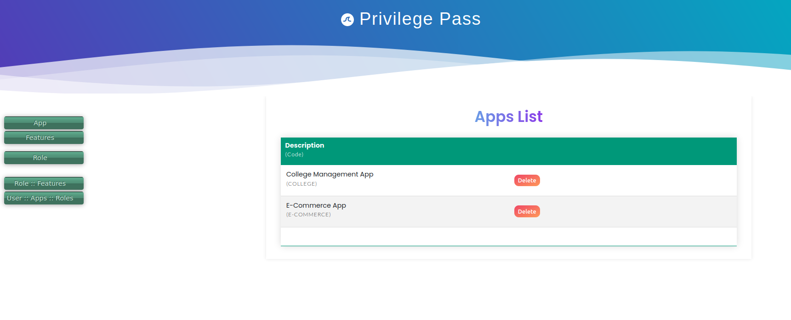
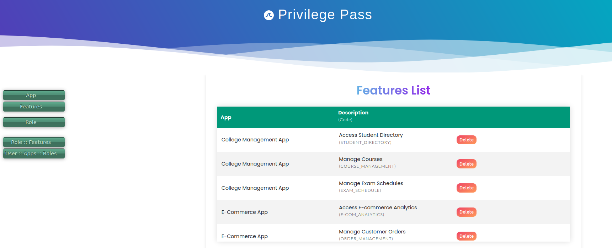
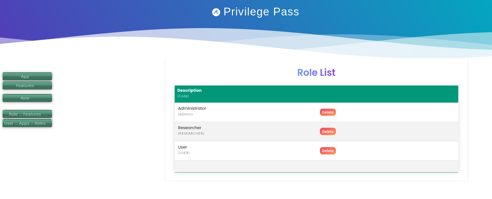
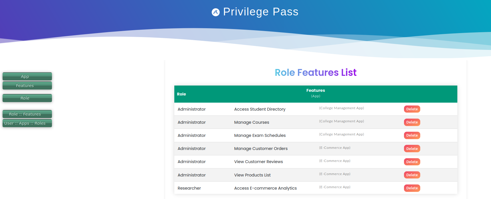
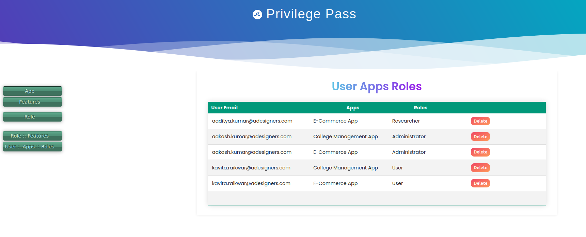

# Privilege Pass (Role Based Access Control)
## UI App
This app is UI portal of the <b>Role Based Access Control</b> system. This app provides screens to setup and manage the RBAC configurations. 

NOTE: Corresponding <b><u>Backend Server</u></b> of the <b>Role Based Access Control</b> setup system:  
https://github.com/aakashkumar1980/apps-rbac-backend

### Screens
This below <b>App</b> screen shows the <u>sample values</u> within an organization. 

This below <b>Feature</b> screen shows the <u>sample values</u> belonging to the App. 

This below <b>Role</b> screen shows the <u>sample values</u> that a user can have within an application. 

This below <b>Role-Features</b> screen shows <u>sample values</u> of the role mapped to the feature (within an app).

This below <b>User-Apps-Roles</b> screen shows <u>sample values</u> of the user's role within an app. It is to be noted that a user can have only one role within an app.
